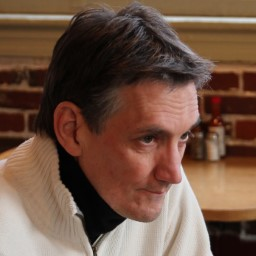

## ARIC 2020

<table>
  <tr>
    <td></td>
    <td colspan="3">
        <b>3rd ACM SIGSPATIAL
    	  International Workshop on Advances
        in Resilient and Intelligent Cities  
        (ARIC 2020)</b>
        Tuesday, November 3, 2020 
        Seattle, Washington, USA 
    </td>
  </tr>
  <tr>
    <td></td>
    <td></td>
    <td></td>
    <td></td>
  </tr>
</table>

### Background

The advancements in sensor technology and ubiquity of connected devices has enabled the generation of large volume of disparate, dynamic and geographically distributed data both by scientific communities and citizens. The socio-technological innovations motivate the concept of smart and connected cities. A smart city is forward-looking and progressive and has the potential to provide high-quality life. A resilient city can preserve its activities and bounce back to its previous stage in the face of an emergency while meeting the daily activities and needs of its citizens. It is imperative to improve our understanding of Resilient and Intelligent Cities in order to leverage these new powerful technologies to tackle the challenges ranging from climate change, public health, traffic congestion, economic growth, to digital divide, social equity, political movements, and cultural conflicts, among others.

The discussion about making a city intelligent and resilient is occurring on two parallel planes. The COVID-19 pandemic has highlighted the difference between smart and resilient cities more so than any other hazard events. For instance, the availability of real-time data and analytics, cloud computing and artificial intelligence (AI) have enabled the development of dashboards and platforms to help with decision-making during this pandemic. Nevertheless, these platforms and dashboards have not been useful in addressing the resilience of the impacted communities as evident from the economic stress that every country is facing around the world. The occurrence of other natural hazards like cyclone Amphan in India or flooding in Michigan due to dam failure during COVID-19 has also brought forth the disconnect between society and technology in this discussion about smart and resilient cities. The challenge now is not only to leverage high performance computing or augmented reality to help with decision making, but also the need to plan and design intelligent cities under the framework of resilience so that online and real-time knowledge discovery from dynamic data streams could be used in conjunction with static data sets to help practitioners and researchers with their policy decisions. 

### Workshop Agenda 

Zoom Link - https://acm-org.zoom.us/j/91533242045?pwd=TkF4MXRrYS9RZFZFa3UzNEZGNDh5UT09

Session I 9:00am-12:00 pm (EST) (UTC: 2pm – 5pm)

|Time | Speaker | Presentation title|

|9:00 - 9:10| Chair | Opening Remarks|

|9:10 - 10:00| Dr. Sokwoo Rhee | Smart Cities and Internet of Things|

|10:00 - 10:24| Toshikazu Seto|Constructing a Digital City on a Web-3D Platform: Simultaneous and Consistent Generation of Metadata and Tile Data from a Multi-Source Raw Dataset|

|10:25 - 10:48| Liam Steadman| Reducing and Linking Spatio-Temporal Datasets with kD-STR|

|10:49 - 11:12| Luis Gustavo Coutinho Do Rego| Exploiting Points of Interest for Predictive Policing|

|11:13 - 11:36| John Pesavento| Data-Driven Mobility Models for COVID-19 Simulation |

|11:37 - 12:00| Avipsa Roy| Characterizing the Spread of COVID-19 from Human Mobility Patterns and SocioDemographic Indicators |

LUNCH BREAK (12 – 1pm EST) (UTC: 5pm – 6pm)

Session II 1:00-5:00pm (EST) (UTC: 6pm – 10pm)

|Time | Speaker | Presentation title|

|1:00 - 2:00|Dr. Wilfred Pinfold| Public Private Partnerships: Value Capture in Urban Development|

|2:00 – 2:22|Mayra Rodriguez Green| Infrastructures and Their Impact on Resilience - Spatial Interactions in Centralized Sewer Systems|

|2:23 - 2:44| Yajie Lee | Seismic Resilience Assessments of Water Pipelines - A Case Study for the City of Los Angeles Water System Pipeline Network|

|2:45 - 3:07| Nalini Venkatasubramanian | Designing Community-Based Intelligent Systems for Water Infrastructure Resilience|

|3:08 - 3:30|Behzad Golparvar| AI-supported Citizen Science to Monitor High-Tide Flooding in Newport Beach, California|

|3:30 – 5:00| Panellists | Panel: Smart and Resilient Cities: Where To Go Next?|

Panellists: 
Steven Cauffman, Ian McRae, Scott Tousley, William Mobley, Ronita Bardhan

### Program

#### Smart Cities and Internet of Things
Presented by Sokwoo Rhee. 

Internet of Things are unleashing an extraordinary cycle of innovation through smart systems in our everyday life. A lot of cities and communities are striving to deploy advanced solutions that can increase productivity, sustainability, and improve the quality of life for residents. This presentation will provide an overview of the structure of smart cities, global trends, and technical issues and challenges. It will also discuss how NIST is working with private sector stakeholders and other U.S. federal agencies to enables cities and communities worldwide to share ideas, develop comprehensive requirements and solutions to their common issues, and leverage their respective investments.

Sokwoo Rhee is Associate Director for Cyber-Physical Systems (CPS) Innovation at the National Institute of Standards and Technology (NIST), U.S. Department of Commerce. He is leading smart city and Internet of Things (IoT) innovation programs at NIST, including the Global City Teams Challenge (GCTC) and the Smart Cities and Communities Framework (SCCF) program. He previously served as a Presidential Innovation Fellow on CPS, a program by the White House. His work and achievements have been recognized through multiple awards including MIT Technology Review’s Top Innovators under 35. He received his M.S. and Ph.D. in Mechanical Engineering from MIT. He is leading the Global City Teams Challenge (GCTC) which aims to create a replicable and scalable model for collaborative incubation and deployment of Internet of Things (IoT) and Cyber-Physical Systems (CPS) solutions to improve the quality of life in smart cities around the world.

#### Public Private Partnerships: Value Capture in Urban Development

By 2050, it is estimated that roughly 70% of the world’s population will live in cities. In an world of high energy climate events, social shocks like SARS, MERS, and COVID, and a need to improve public services and efficient resource-usage there are huge benefits to the effective use of technology in the municipal environments. So why has it been so difficult to deploy technology to improve life and health in the municipal environment. How do public and private entities work together and how do we facilitate value capture in a way that benefits communities while ensuring business incentives are sufficient to encourage investment.

Wilfred Pinfold is the Chief Executive Officer of urban.systems Inc, a company that builds vibrant
communities using technology to facilitate civic engagement, deliver services and share resources.
Before leading urban.systems he had a 23 year career at Intel where he led research and development
programs in Extreme Scale Computing, Internet of Things and Smart Cities. He is a Research Professor in
Computer Science at Portland state University, has taught classes in business, innovation, aeronautics,
ocean systems and has more than 30 years of experience in computational and data science. He is a
member of the City of Portland Technology Oversight committee, holds multiple board positions and is
the Honorary Consul for the United Kingdom in Oregon. He received his Ph.D. in Computational Fluid
Dynamics from the University of Strathclyde, Glasgow and attended the Stanford Executive Program.

#### Panel - Smart and Resilient Cities: Where To Go Next?
While research and development activities are being pursued to make cities both smart and resilient, there is still a gap in the discussion how to leverage smart initiatives to make cities resilient to extreme events. The COVID-19 pandemic has highlighted this gap and brought forth to our notice the need to leverage public-private partnerships, technological advancements, and knowledge gained from research in the area of resilience to discuss what the next generation of resilience research and application should be. The invited panelists will discuss the issue of geo-design and its role in making cities resilient, current standards and policies that enable integration of smart city initiatives and resilience framework, the role of private entities and policy makers in translating research and development activities to policies to ensure stakeholder buy in that will make us achieve the goal of intelligent and resilient cities. 

Panellists:

Dr. Stephen Cauffman

Mr. Cauffman is the Section Chief, infrastructure Development and Recovery in the Infrastructure Security Division, Cybersecurity and Infrastructure Security Agency (CISA). In this role he oversees efforts to apply a systems-based approach to incorporating resilience measures into infrastructure planning through the development of the Infrastructure Resilience Planning Framework (IRPF) and associated tools. In addition to his CISA role, Mr. Cauffman represents the agency as an Action Officer on the Mitigation Framework Leadership Group (MitFLG) and co-chairs the development and implementation of the National Mitigation Investment Strategy. Mr. Cauffman also serves as a federal board member for the DHS Coastal Resilience Center of Excellence, the Critical Infrastructure Resilience Institute, and the Flood APEX program.

Before joining CISA, Mr. Cauffman worked for the National Institute of Standards and Technology (NIST) for 19 years. Most recently, he was a key member of the Community Resilience Group, where he led efforts to implement the Community Resilience Planning Guide to support local resilience planning efforts. Mr. Cauffman initiated resilience research at NIST in 2011 with funding from DHS S&T, to study standards gaps for building and infrastructure design and construction that could impact resilience. He wrote the program plan for NIST’s Community Resilience Program that began in 2013. Mr. Cauffman held several leadership positions at NIST including leader of the Structures Group, Deputy Chief and Acting Chief of the Materials and Structural Systems Division. He was the program manager for NIST’s study of the World Trade Center Disaster and led a 26-member team to study the performance of buildings and infrastructure during hurricanes Katrina and Rita. Mr. Cauffman’s early career involved management of research and development of composite structures for aerospace, commercial, and civil engineering applications.
  
Dr. Ian McRe

Ian McRae is an Innovation Designer at Sherwood Design Engineers where he focuses on a variety of projects that promote Low Impact Design (LID) stormwater management at multiple scales and the development of water sustainability guidelines for a wide range of projects. His work experience includes infrastructure master planning and decentralized stormwater management strategies. His recent project experience includes parks and open spaces, urban river master planning, development of flood control tactics, and urban forestry management strategies. With a Bachelor of Science in Molecular Environmental Biology and a Master in Landscape Architecture from UC Berkeley, his work involves the development of methods to evaluate the environmental performance metrics of existing and proposed conditions. Ian has served as a visiting professor at the University of Tennessee’s Department of Plant Sciences and as a lecturer at UC Berkeley’s College of Environmental Design. As a designer, he strives to create environments that operate in a multi-scalar fashion, with the belief that integrating a project site into the broader system is important to creating resilient communities. Ian has used a variety of CFD climate modeling software platforms to evaluate design proposals under a variety of climate scenarios. His projects have looked at air quality and pedestrian comfort, as well as investigating urban heat islands and thermal mitigation strategies. His methods involve the production of site-specific environmental performance metrics using local meteorological data and 3-D modeled site conditions by simulating the complex interactions of building structure, atmosphere, soil and vegetation processes. 
 
Scott Tousley

Mr. Tousley is an accomplished leader of homeland and national security challenges, solutions and teams, in multiple areas of homeland security and information technology. Good results in multiple environments of change – government and commercial, civil and military, a variety of risk and threat problems, and many complex interagency challenges. Experience leading organizations and teams of up to 175 staff and $80 million budget. Strengths in designing, supporting and leading complex technology/people programs, and with key functions like personnel hiring and management, budget formulation and defense, program evaluation and oversight, communications, procurement, etc. Deep experience with continuous learning, planning and resilience, Smart Cities & Communities, Cyber-Physical Systems and Industrial Control Systems and the "Internet of Things," and cross-domain collaboration and teamwork. And an experienced singer and team artist of musical theater, light opera, choral music, a cappella and barbershop. 

Dr. William Mobley

Dr. Mobley is an Associate Research Scientist with the Institute for Disaster Resilient Texas. He is assisting in planning and coordinating for the Texas Disaster Information System (TDIS). Which will become the primary data hub for Natural Hazards in Texas, acquiring and disseminating data from a variety of data sources. His research leverages Volunteered Geographic Information as sensors to identify flood hazard and risk through data-driven and machine learning techniques. He holds a Ph.D. in Urban and Regional Sciences from Texas A&M University, as well as a Master of Urban Planning from the University of Wisconsin-Milwaukee. 

Dr. Ronita Bardhan

Dr Ronita Bardhan is University Lecturer of Sustainable Built Environment at the Department of Architecture, University of Cambridge, UK. She holds visiting position at Stanford University and Indian Institute of Technology Bombay.  She works on the niche sector of habitat design, energy decisions and gender equality for low-income housing in Global South, especially in the slum rehabilitation housing of Mumbai. Her tractable research informs demand-side design solutions which positively affects energy security, gender equality and well-being while entailing fewer environmental risks. She believes that data-driven design of built environments can effectively address sustainability. Through her research, she seeks for the transdisciplinary collaboration where she soft-couples building design, engineering with social science. She is the recipient of The Building Energy Efficiency Higher & Advanced Network (BHAVAN) Fellowship 2016-2017, USA and Charles Wallace India Trust Fellowship, UK in recognition of her work in building design and energy efficiency for low-income communities. Ronita has been awarded the Young Researcher Award 2012 and Exceptional Women of Excellence, 2019 by the Women Economic for her innovative contribution in the field of Sustainable Design and Urban Regeneration. 

Dr Bardhan is part of Behaviour and Building Performance (BBP) research group and Global Energy Nexus in Urban Settlements (GENUS) network. 

### Workshop Registration 

information can be found [here](https://sigspatial2020.sigspatial.org/registration/).

### Workshop Format

Workshop will be held virtually. Please use the Zoomlink to participate in the workshop:https://acm-org.zoom.us/j/91533242045?pwd=TkF4MXRrYS9RZFZFa3UzNEZGNDh5UT09

### Workshop Organizers

General Chair: Bandana Kar, Oak Ridge National Laboratory (karb@ornl.gov)

### Program Co-Chairs: 

Bandana Kar, Oak Ridge National Laboratory (karb@ornl.gov)

Xinyue Ye, Texas A&M University (xinyue.ye@tamu.edu)

Shima Mohebbi, George Mason University (smohebbi@gmu.edu)

Guangtao Fu, University of Exeter (G.Fu@exter.ac.uk)

### Program Committee:

Hussain	Aziz，		Kansas State University 

Yao-yi	Chiang，	University of Southern California 

Hongchao 	Fan，		Norwegian University of Science and Technology

Subharoop 	Ghosh，		ImageCat Inc.

Qunying 	Huang，		University of Wisconsin-Madison

Xiao 		Huang，		University of South Carolina

Zhenlong 	Li，		University of South Carolina

Ian 		McRae，	UC Berkley

Sarbeswar	Praharaj， 	Arizona State University

Christine 	Prouty，		American Society of Civil Engineers

Bing 		She，		University of Michigan

Daoqin 	Tong，		Arizona State University 

Mingshu 	Wang，		University of Twente

Rou-Qian	Wang，		New Jersey Institute of Technology

Shaohua 	Wang，		New Jersey Institute of Technology

Liping 	Yang， 		University of New Mexico

Gregory	Zacharewicz，	University of Bordeaux, France

Fan 		Zhang，		MIT

Lei 		Zou， 		Texas A & M
	

### Student Representative 

Babak Aslani, George Mason University 

Jiaxin Du, Texas A&M University 

Mayra Rodriguez Bennadji, University of Exeter 

Avipsa Roy, Arizona State University 

### Organizer Biographies

__Dr. Bandana Kar__ is a R & D Staff in the National Security Emerging Technologies Division at Oak Ridge National Laboratory (ORNL). She was an Associate Professor in the Department of Geography and Geology at the University of Southern Mississippi before joining ORNL. Her research addresses problems in science, technology and policy with a special focus on energy and transportation infrastructure resilience, smart cities and urban resilience, extreme event risk modeling and simulation, risk communication and geo-visualization. She received the Emerging Scholar Award in 2019 from the American Association of Geographers’ Regional Development and Planning Specialty Group) and was a fellow of the National Science Foundation’s Enabling the Next Generation of Hazards and Disasters Researchers Fellowship Program in 2009. She is a co-editor of the book Risk Communication and Community Resilience. She is the chair of the Technical Division Directors’ Council of the American Society for Photogrammetry and Remote Sensing, chair of the Geographic Information Science and Systems specialty group of the American Association of Geographers. She is also an Associate Editor/Social and Behavioral Science Editor for the IEEE Natural Hazards Review. She has been funded by the National Science Foundation, Department of Homeland Security, Department of Energy, NASA.

__Dr. Xinyue Ye__ is an Associate Professor in Department of Landscape Architecture and Urban Planning, Texas A&M University, where he also directs Urban Data Science Lab. He integrates urban science and computational science towards information visualization, urban informatics and spatial social network analysis – the mapping of relationships among individuals in virtual, perceived, and physical networks. He models the space-time perspective of socioeconomic inequality and human dynamics for applications in various domains, such as economic development, disaster response, transportation and land use, public health and urban crime. He won the national first-place research award from University Economic Development Association in 2011 and received the Regional Development and Planning emerging scholar award from American Association of Geographers in 2012. His work has been funded by the National Science Foundation, National Institute of Justice, Department of Commerce, and Department of Energy.

__Dr. Shima Mohebbi__ is an assistant professor in the Department of Systems Engineering and Operations Research at George Mason University (GMU). Prior to joining GMU, she was an assistant professor in the School of Industrial and Systems Engineering at the University of Oklahoma, and a visiting scholar in the University of Exeter’s Center for Water Systems, UK. Her research areas include game theory, hybrid simulation models, and interpretable data mining with applications in resilient infrastructure systems, healthcare systems, sustainable urban water systems, and smart cities. Her research is mainly supported by the NSF and the US DOT. She serves as a board director in the Modeling and Simulation Division of the Institute of Industrial and Systems Engineers, and an associate editor for the International Journal of Applied Logistics.

__Dr. Guangtao Fu__ is a professor of water intelligence at the Centre for Water Systems, University of Exeter, UK. His research focuses on developing and applying computer models, data analytics and artificial intelligence algorithms to tackle urban water challenges related to urban flooding, water supply and urban wastewater management. He is a Royal Society Industry Fellow and Turing Fellow at the Alan Turing Institute. He has been the principal/co-investigator on more than 20 research projects funded by EU, EPSRC, British Council, Royal Society, and Royal Academy of Engineering. He has authored 140 scientific papers and received a number of awards including the 2014 ‘Quentin Martin Best Practice Oriented Paper’ award and 2018 ‘Best Research-Oriented Paper’ award both from the American Society of Civil Engineers. He was elected as a Fellow of the International Water Association (IWA) in July 2018 in recognition of his ‘distinguished contribution to the fields of water science, technology and management’ in the words of IWA.

### Objective

Following our success in ARIC 2019, the *3rd International Workshop on Advances on Resilient and Intelligent Cities (ARIC 2020)* will bring together researchers and practitioners from different disciplines to address the challenges of integrating computing, analytics, public health research, infrastructure resilience and urban sciences in building intelligent and resilient cities that can withstand the impacts of future pandemics and extreme events. This workshop will provide a platform to discuss research areas and issues in modeling urban design by considering sensor technology, edge computing, interactive visualization, modeling and simulation, and advanced data analytics in the context of the current pandemic and continuing extreme events to prepare for future events and build resilient cities.  Given the need to implement artificial intelligence and real-time analytics on the edge to meet the demands of such cities, this workshop fits the general theme of ACM SIGSPATIAL. 

This year’s workshop invites papers in the following areas:
-	Analytics integrating heterogenous spatio-temporal data for prediction, detection of anomalies and unusual patterns.
-	Real-time analytics of dynamic and distributed data
-	Edge and distributed computing and assess resilience of cyber-physical systems
-	Human dynamics in the Age of Smart/Intelligent Systems
-	Spatial social network analytics in the built environment
-	Theoretical and practical applications of Internet of Things in urban settings 
-	Optimization of sensor locations for urban resilience in the context of design and planning
-	Urban mobility data management and visualization
-	Using augmented reality, simulations and 3D-geovisualization for urban planning and decision making
-	Case studies of successful deployment of smart and resilient cities
-	Policies and theoretical framework for successful deployment of intelligent and resilient cities
-	Existing state-of-the-art and future directions in achieving both smart and resilient cities

Specific attention will be given to papers that focus on resilience (community and infrastructure) in the context of COVID-19, and integrate heterogenous data and real-time computing/analytics/visualization to aid with the pandemic and other co-occurring hazards across the world. 

